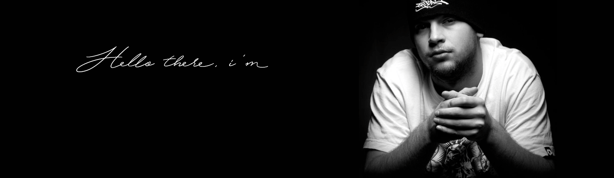

<h1 align='center'>Howdy, y'all  :wave: . Welcome to my GitHub profile!</h1>

## &#x270d; Little about me 

My name is Anton   I'm a Front-end developer. I can both write clean code and design the graphic. I love programming, exploring, and learning about new things, and am proud of my results. And at the moment, working as a freelancer, I improve my level in various fields. I'm also interested in 3D graphics, IoT, Game dev, Web 3.0 and I like to do DIY projects with Raspberry Pi.

##  Technologies & Tools

Main stack:

👨‍🎓 I’m currently practice JavaScript(ES6+), ReactJS, TypeScript. And some Python.

  

### Extra skills:

### Graphic skills:

## I will be glad to offers for new experience:

  

📄 Current CV is available for
  <a href="https://github.com/knnfmx/knnfmx/raw/9c3e9cc43a0365ea514e6bc8a34aa61eb0c8b837/assets/CV-2023n.pdf" download style="color: #00bbb8"> download</a>

 

📧 E-mail:
  <a href="mailto:fmxhighlife@gmail.com" style="color: #00bbb8">fmxhighlife@gmail.com</a>

## Additional Info

  
 💡 Working on 

   
  

    
  

  
 &#x1f4c8; GitHub Stats 

   
  

    
  

### Other achievements:

## 🖖 You can find me around the web

<h2 align="center" style="color: #00bbb8">If you liked ❤️ my profile, then you can put a star ⭐ and subscribe to my updates.   see ya! 
  
</h2>

  

